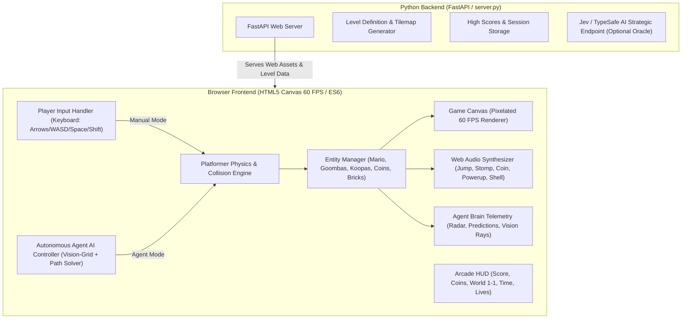

# 🍄 Super Mario Web Platformer: Dual-Play (Player + Autonomous Agent)

## Goal Description
Create a full-fledged, real-time 2D Super Mario platformer in the browser, featuring classic NES Mario physics, interactive blocks, power-ups, classic enemies, and dual-play capability:
1. **Manual Play (You Play)**: Smooth, responsive platformer controls (run, variable jump, dash, enemy stomp).
2. **Autonomous Agent Play (AI Plays)**: Real-time autonomous AI bot that senses the platformer environment ahead (obstacles, enemy paths, pits, mystery blocks), predicts jump trajectories, stomps foes, collects power-ups, and navigates obstacles autonomously.
3. **Agent Vision & Telemetry Dashboard**: Real-time HUD showing what the AI sees (bounding boxes, collision rays, danger radar, action probabilities).
4. **Standalone Web Application**: Dedicated full-screen arcade platformer served via FastAPI + Uvicorn with zero npm/node build dependencies.

---

## Architecture Overview

---

## User Review Required

> [!IMPORTANT]
> **Real-time 60 FPS Canvas Engine**: The platformer is built using HTML5 2D Canvas with sub-pixel collision resolution (`AABB` sweep vs tilemap) and zero external sprite image dependencies—all classic NES Mario sprites (Small Mario, Super Mario, Goombas, Koopas, Mystery Blocks, Shroom power-ups) are procedurally drawn or pixel-rendered to ensure instant offline loading with 0 latency and 0 broken image assets.

> [!TIP]
> **Live Agent Vision Overlay**: When in **Agent Mode**, you can toggle the **Vision Overlay (`[V]`)** to see the AI's internal sensory perception: jump trajectory arcs, enemy detection cones, hazard boxes, and block targets drawn directly onto the canvas in real time.

---

## Key Gameplay Mechanics

### 1. Mario Physics & Character States
- **Small Mario**: 16×16 px. Can run, jump, skid, and stomp enemies.
- **Super Mario**: 16×32 px. Triggered by collecting a Power-up Mushroom. Can smash breakable brick blocks from below. Shrinks back to Small Mario with 2 seconds of invulnerability flicker if hit.
- **Movement Physics**:
  - Horizontal acceleration, deceleration friction, and skidding turn-around physics.
  - Variable-height jump (holding jump key rises higher; tapping results in a short hop).
  - Smooth camera scrolling that tracks Mario forward across the level.

### 2. Interactive Blocks & Collectibles
- **Mystery `[?]` Block**:
  - Bounces upward when bumped from beneath.
  - Spawns either a bouncing gold coin (+200 pts) or a sliding Power-up Mushroom.
  - Turns into a solid inactive metal block after being hit.
- **Breakable Brick Block**:
  - Super Mario bumps and shatters it into 4 spinning debris pieces with sound.
  - Small Mario bumps it and shakes it without breaking.
- **Coins**: Scattered in floating arcs and hidden in blocks.

### 3. Classic Enemies & Stomp Mechanics
- **Goomba**:
  - Walks forward, turns around when hitting obstacles.
  - Stomping from above squashes it flat for 0.5s, awards 100 points, and bounces Mario upward.
  - Walking into it horizontally damages/kills Mario.
- **Koopa Troopa**:
  - Stomping it retreats it into its shell.
  - The shell becomes stationary; walking into it kicks it sliding rapidly.
  - Sliding shells plow through and eliminate any Goombas in their trajectory!

### 4. Autonomous Agent ("Mario Bot") Architecture
The autonomous agent runs every tick (60 FPS) with multi-layered heuristics:
- **Vision Grid**: Scans tiles and entities ahead up to 12 tiles (192 px).
- **Hazard Evaluator**:
  - Detects pits/gaps and calculates required jump velocity + sprint timing.
  - Detects incoming Goombas/Koopas: triggers stomp trajectory if Mario is airborne or initiates timed jump to avoid ground contact.
- **Loot Opportunist**: Targets nearby mystery blocks to bump them and pursues moving mushrooms.
- **Controls Generator**: Outputs synthetic controller inputs (`left`, `right`, `jump`, `sprint`) identical to a human player.

---

## Proposed Changes

### Backend (FastAPI)

#### [MODIFY] `server.py`
- Adapt server to serve the Super Mario platformer at root `/`.
- Add endpoints:
  - `GET /api/mario/level`: Returns tilemap configuration (World 1-1 layout, block coordinates, enemy spawn points).
  - `POST /api/mario/scores`: Records run stats (score, coins, time, mode).
  - `GET /api/mario/scores`: Fetches leaderboard / past runs.

---

### Frontend Engine (`web/`)

#### [NEW] `web/mario/index.html` (or `web/index.html`)
- Dedicated Super Mario arcade cabinet layout:
  - Retro arcade marquee banner.
  - Top Game HUD: `MARIO [Score]`, `COINS [x00]`, `WORLD [1-1]`, `TIME [400]`, `LIVES [x3]`.
  - Mode Switcher: `🎮 Human Player` vs `🤖 Autonomous Agent`.
  - Visual Canvas viewport (scaled 2x/3x for sharp pixel art).
  - Agent Brain Telemetry side-panel:
    - Current AI Objective (e.g. `SPRINT_JUMP_GAP`, `STOMP_GOOMBA`, `HUNT_MUSHROOM`).
    - Distance to nearest hazard / pit.
    - Action state indicator (Running, Jumping, Ducking).
    - Vision Ray toggle (`[V]`).
  - Tactile on-screen controls for mobile/tablet + keyboard hotkey legend (`A`/`D` or `Arrows` to move, `Space`/`W` to jump, `Shift` to sprint).

#### [NEW] `web/static/css/mario.css`
- Classic NES arcade styling:
  - Retro pixel fonts (`'Press Start 2P'`, monospace).
  - CRT screen scanline filter (toggleable).
  - Dark arcade chassis border with glowing indicator LEDs.

#### [NEW] `web/static/js/mario_audio.js`
- Web Audio API synthesizer tuned to classic NES frequencies:
  - `playJump(isSuper)`: Ascending frequency sweep.
  - `playStomp()`: Crunchy percussive pop.
  - `playCoin()`: Twin-tone high chime (B5 -> E6).
  - `playPowerup()`: Ascending 8-bit scale jingle.
  - `playPowerdown()`: Descending warp chirp.
  - `playBrickBreak()`: Low crunchy noise burst.
  - `playKickShell()`: Resonant metallic kick.
  - `playDie()`: 8-bit descending sad melody.

#### [NEW] `web/static/js/mario_engine.js`
- The core platformer engine:
  - `TileMap`: Grid representation of World 1-1 (Ground, Pipes, Mystery Blocks, Bricks, Pits).
  - `Player`: State machine (Small, Super, Invulnerable), position, velocity, bounding box, animation frames.
  - `Enemies`: Goomba and Koopa Troopa classes with AI patrol and shell states.
  - `Items`: Bouncing Coins, Sliding Mushrooms, Shattered Brick particles.
  - `Collision`: Continuous AABB collision solver with step correction and one-way platform interactions.
  - `Camera`: Smooth horizontal scrolling clamping to Mario's progress.

#### [NEW] `web/static/js/mario_agent.js`
- The Autonomous Bot:
  - Real-time environment scanner.
  - Action selector: decides `LEFT`, `RIGHT`, `JUMP`, `SPRINT`.
  - Jump arc solver for gap clearance and enemy stomping.
  - Telemetry emitter: sends live perception data to HUD and canvas overlay.

---

## Verification Plan

### Automated Tests
1. **Engine Physics & Collision Test (`test_mario_engine.py`)**:
   - Verify gravity application and ground landing.
   - Verify variable jump height logic.
   - Verify block collision from below (mystery block bump, coin spawn).
   - Verify enemy stomp detection (top hit vs side hit).
2. **Server & Static Files Test**:
   - Verify FastAPI serves the game without 404s.
   - Verify level endpoint returns valid tile matrix.

### Manual Verification
1. **Manual Mode**:
   - Run left/right, check friction and skidding.
   - Jump on Goomba: confirm Goomba is squashed, score increases, and Mario bounces.
   - Hit Mystery Block: confirm coin pops out with chime sound.
   - Hit Mushroom Block: confirm Mushroom slides along ground, Mario collects it, grows into Super Mario.
   - Stomp Koopa: confirm it retreats into shell; kick shell and confirm it slides.
2. **Agent Mode**:
   - Switch to Agent Mode: confirm Mario runs forward autonomously.
   - Confirm agent detects pit ahead and executes sprint-jump.
   - Confirm agent stomps or leaps over Goombas and Koopas.
   - Toggle Vision Overlay (`[V]`) and observe collision rays and danger boxes.
