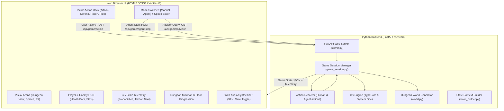

# 🎮 Browser Web RPG: Jev Plays the Game (Manual + Agent Dual-Play)

## Goal Description
Transform the terminal CLI game into a rich, browser-playable Web RPG with actual visual UI. The game will support **two playable modes**:
1. **Manual Player Mode ("You Play")**: You control the adventurer with interactive buttons, skill decks, inventory management, and hotkeys.
2. **Autonomous Agent Mode ("Jev Plays")**: Jev (TypeSafe AI System One) plays autonomously turn-by-turn with live thought visualization, speed controls, and auto-play/pause.
3. **Hybrid AI Advisor ("Oracle Mode")**: When playing manually, you can consult Jev in real-time to see what the System One model recommends and with what probability.

The web app will run locally via FastAPI and Uvicorn, serving an arcade-quality, atmospheric dark fantasy web UI with zero build dependencies (no npm/node required).

---

## Architecture Overview



---

## User Review Required

> [!IMPORTANT]
> **No Node.js / NPM build pipeline needed**: The frontend will be built with modern vanilla ES6+, HTML5, and CSS3, styled with custom dark-fantasy RPG styling, SVG sprites, and Web Audio API synthesized sound effects. This ensures you can launch the game instantly with a single Python command (`python server.py`) without compiling or installing heavy web node modules.

> [!TIP]
> **Seamless Mode Switching**: You can toggle between **Manual Player Mode** and **Autonomous Agent Mode** at any moment during an active run. For instance, you can let Jev clear the early rooms, take over the controls for a tricky fight, and then hand control back to Jev for the boss!

---

## Key Features & UI Design

### 1. Visual Stage & Battler Arena
- **Animated Battler Cards**:
  - Player Hero Card: Health bar, equipped weapon/shield, potions bandolier, gold stash.
  - Enemy Sprite / Encounter Card: Goblin, Orc Warrior, Dark Mage, Troll, and Dragon Boss with thematic SVG avatars, health bars, attack/defense stats, and threat indicator.
  - Exploration Chambers: Visual representations for Treasure Vaults, Celestial Shrines, Spiked Traps, Crossroads, and Desolate Halls.
- **Dynamic Combat FX & Floating Damage**:
  - Screen shake on heavy strikes, flash animations on hit.
  - Floating damage numbers (`-14`, `CRIT! -32`, `+40 HP`, `+50 Gold`) floating upwards and fading.
- **Dungeon Progression Bar & Minimap**:
  - Horizontal floor tracker (Floors 1-5).
  - Room progression nodes showing cleared rooms, current location, and remaining mystery/boss rooms.

### 2. Dual Play Modes
- **🎮 Manual Mode (You Play)**:
  - Big responsive action buttons with keyboard shortcuts (`1`, `2`, `3`, `4`, `Space`).
  - Combat Actions: `[1] Attack ⚔️`, `[2] Defend 🛡️`, `[3] Drink Potion 🧪`, `[4] Flee 🏃💨`.
  - Room Actions: `[1] Open Chest 💎`, `[1] Drink Shrine ✨`, `[1] Disarm Trap 🔧`, `[2] Search Chamber 🔍`, `[3] Bypass Room 🚶`.
  - Fork Actions: `[1] Left Corridor ⬅️`, `[2] Right Corridor ➡️`, `[3] Backtrack ↩️`.
  - **"Ask Jev" Advisor Button**: View Jev's analysis and recommendation before deciding, or click "Follow Jev's Move".
- **🤖 Autonomous Agent Mode (Jev Plays)**:
  - Auto-play toggle with Play/Pause button.
  - Step button (advance 1 turn at a time).
  - Speed slider: Slow (2.0s), Normal (1.0s), Fast (0.5s), Turbo (0.2s).

### 3. Jev Brain Telemetry Dashboard
- **Live System One Visualizer**:
  - Current Action Decision with confidence percentage badge.
  - Multi-choice probability distribution bar chart (e.g. `ATTACK: 74%`, `DEFEND: 16%`, `USE_POTION: 7%`, `FLEE: 3%`).
  - Threat / Value / Risk Meter: 0 to 10 visual gauge with dynamic color grading.
  - Noul Proactive Probabilities: Pre-emptive potion chance and Flee viability probability.
  - Real-time API Latency ticker (e.g., `⚡ 142ms`) and API connectivity status.

### 4. Audio & Game Feel
- **Web Audio API Sound Synthesizer**:
  - Procedurally generated retro sound effects without external audio file dependencies:
    - Sword slash / hit sound
    - Shield block sound
    - Critical hit fanfare
    - Potion drink glug
    - Gold pickup jingle
    - Victory fanfare and game over chords
  - Sound mute / unmute button in top navbar.

### 5. Adventure Chronicle / Combat Log
- Real-time scrolling combat log with color-coded badges for turn numbers, critical strikes, Jev thoughts, and rewards.
- Log filter tabs: `All`, `Combat`, `Loot`, `AI Brain`.

---

## Proposed Changes

### Backend Engine & API Layer

#### [NEW] `game_session.py`
A comprehensive, thread-safe session manager that wraps the game state:
- Maintains active player, dungeon, current floor, current room, logs, game status (`PLAYING`, `VICTORY`, `GAME_OVER`).
- Exposes:
  - `new_game(mode="manual", floors=5, seed=None)`
  - `get_state()`: Serializes complete state to JSON (including available actions for UI).
  - `execute_player_action(action: str)`: Executes a human move via `action_resolver.py`.
  - `execute_agent_turn()`: Calls `jev_engine.py` using current state context and resolves turn.
  - `get_agent_advice()`: Queries `jev_engine.py` for advice on the current state without advancing the game.
  - Floor transitions, camp rests, potion purchases between floors.

```python
# Sketch of game_session.py
class GameSession:
    def __init__(self, floors: int = 5, seed: int | None = None):
        self.dungeon = Dungeon(total_floors=floors)
        self.player = JevPlayer()
        self.mode = "manual"  # "manual" or "agent"
        self.logs = []
        self.current_floor = 1
        self.current_room_idx = 0
        self.last_decision = None
        self.status = "PLAYING" # "PLAYING", "VICTORY", "GAME_OVER"
```

---

#### [NEW] `server.py`
FastAPI web server serving API endpoints and static assets:
- Endpoints:
  - `GET /`: Serves `web/index.html`.
  - `POST /api/game/new`: Starts a new game session.
  - `GET /api/game/state`: Fetches current game state.
  - `POST /api/game/action`: Submits a manual player action.
  - `POST /api/game/agent-step`: Triggers one turn of Jev AI play.
  - `GET /api/game/advisor`: Queries Jev's recommendation for the current turn.
  - `GET /api/health`: Healthcheck & TypeSafe API key status.
- Mounts `/static` for styles, scripts, and audio assets.
- CLI launcher (`python server.py --port 8000`) with auto-opening browser option.

---

#### [MODIFY] `action_resolver.py`
- Enhance `resolve_combat`, `resolve_explore`, and `resolve_fork` so they can handle both:
  1. `CombatDecision` from Jev.
  2. Direct player action strings (`"ATTACK"`, `"DEFEND"`, `"USE_POTION"`, `"FLEE"`) without requiring fake decision objects.
- Ensure all detail strings use clean formatting (strip Rich markup when sending to web, or preserve structured text).

---

#### [MODIFY] `requirements.txt`
Add `fastapi>=0.110.0` and `uvicorn>=0.28.0` (both already installed in the user's environment, but documenting them in `requirements.txt`).

---

### Web Frontend Layer

#### [NEW] `web/index.html`
- Dark fantasy styled layout:
  - Header: Title, Floor Indicator, Mode Switcher (`🎮 Manual` vs `🤖 Jev Agent`), Agent Speed Slider, Sound Toggle, New Game Button.
  - Main Grid:
    - **Stage View**: Minimap strip, visual battler chamber (animated SVG hero and monster cards, combat particle effects, floating damage text).
    - **Control Deck**: Dynamic action button bar based on encounter type (Combat, Explore, Fork). Keyboard shortcuts indicators.
    - **Chronicle Log**: Filterable scrolling activity feed.
  - Right Sidebar:
    - **Jev System One Dashboard**: Thought status, Confidence dial, Probability distribution bars, Threat Level gauge, Noul decision pills, latency meter, "Ask Advisor" trigger.
  - Victory & Defeat Modals: End-of-game summary with stats, rooms cleared, gold looted, and restart button.

#### [NEW] `web/static/css/game.css`
- Dark fantasy theme with deep dungeon slate `#0f111a`, luminous amber `#f59e0b`, crimson `#ef4444`, mana azure `#38bdf8`, and emerald `#10b981`.
- Pixel-font / medieval modern typography.
- CSS animations for attack slash, screen shake, pulse, health bar depletion, and floating damage numbers.
- Responsive layout that fits desktop, tablet, and mobile screens.

#### [NEW] `web/static/js/audio.js`
- Web Audio API procedural sound synthesizer:
  - `playAttack()`, `playCrit()`, `playBlock()`, `playPotion()`, `playGold()`, `playDefeat()`, `playVictory()`.
  - Mute/unmute state with persistent browser localStorage setting.

#### [NEW] `web/static/js/game.js`
- Core frontend game controller:
  - State polling & SSE/fetch synchronization.
  - Mode controller: Manual action dispatch vs Agent auto-run interval loop.
  - Visual damage animation dispatcher (spawns floating text and screen shake).
  - Jev telemetry visualizer: dynamically renders probability bars, threat gauge, and Noul pills.
  - Keyboard shortcut listeners (`1`, `2`, `3`, `4`, `Space`, `M` for mute, `A` for advisor).

---

## Verification Plan

### Automated Verification
1. **API Unit & Route Tests**:
   - Run a test script (`python scratch/test_api.py`) that boots the FastAPI TestClient:
     - `POST /api/game/new` -> Returns initialized state.
     - `POST /api/game/action` -> Applies ATTACK / DEFEND / USE_POTION and updates health/enemy.
     - `POST /api/game/agent-step` -> Successfully queries Jev System One (or fallback) and resolves agent turn.
     - `GET /api/game/advisor` -> Returns structured decision with probabilities and threat level.
2. **Backward Compatibility Test**:
   - Run `python -c "import main; import game_loop; import world; import jev_engine; print('CLI dependencies intact')"` to verify existing CLI game is unaffected.

### Manual Verification
1. Start the server with `python server.py --port 8000`.
2. Open `http://localhost:8000` in the browser.
3. Test **Manual Mode**:
   - Attack an enemy, observe floating damage numbers, enemy health bar decrease, and sound effect.
   - Use Defend, drink a potion, or disarm a trap.
   - Click "Ask Jev" advisor and observe Jev's recommendations and probability breakdown.
4. Test **Agent Mode**:
   - Switch toggle to "Agent Mode (Jev Plays)".
   - Click "Auto Play" and watch Jev autonomously play turn-by-turn.
   - Adjust speed slider between slow, normal, and turbo.
   - Click "Pause", take 1 manual turn, then resume agent mode to test seamless handoff.
5. Reach victory or game over, check modal dialog and play again button.
